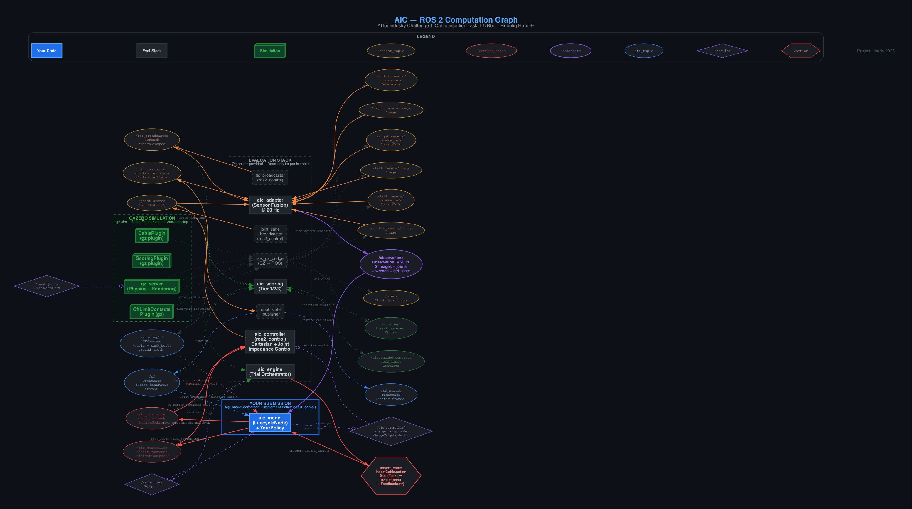

# Project Automaton

This repository consists of agent-assisted code written for Intrinsic's
AI for Industry Challenge. The codebase contains robotic simulation and
control experiments with MuJoCo, Isaac Lab, Gazebo, and ROS 2, including
cable-insertion policy prototypes, observation logging, task-board
randomisation, mesh and pose tools, SO-101 print files, and study notebooks.



[Diagram PDF](docs/ros2-graph/aic_ros2_graph.pdf) ·
[Experiment code](intrinsic-src/) ·
[Research notes](research-notes/)

## Policy prototypes and data capture

The [policy directory](intrinsic-src/custom_policies/) contains three
experimental ROS 2 policies:

- `AutomatonV0.py`: receives observations and sends approach-and-hold
  commands through the AIC motion interface.
- `AutomatonV1.py`: captures wrist-camera images and uses OpenCV contours
  to detect port candidates. It estimates position with an assumed depth.
- `DataLogger.py`: combines a ground-truth-guided insertion controller
  with observation capture. It saves camera images, joint states, wrist
  wrench data, controller state, and timestamps.

These files require the AIC interfaces and access through its policy loader.

## MuJoCo tools and simulator assets

The [MuJoCo tools](intrinsic-src/tools/mujoco/) include:

- Task-board randomisation with a seed and configurable component counts.
- A standalone policy runner with wave-arm and target-approach modes.
- Mesh-axis checks and correction-quaternion calculations.
- Physics-based component settling and pose export.
- Coordinate transforms and pose extraction for Isaac Lab.
- GLB material and texture extraction for MJCF assets.
- MJCF preparation with shorter asset filenames for Isaac Sim imports.

[Scenes](intrinsic-src/scenes/mujoco/) contain task-board and component
test environments. [Meshes](intrinsic-src/meshes/mujoco/) contain connector,
port, and mount geometry in OBJ and STL formats.

## ROS 2 and Gazebo utilities

The MuJoCo launcher starts the Zenoh router, simulator, policy, and trigger.
The action client sends an insertion request to the AIC policy node.
The [bag reader](intrinsic-src/tools/gazebo/bag_reader.py) extracts
joint-state and force-torque data from recorded trials.

The [diagram source](docs/ros2-graph/aic_ros2_graph.py) generates the
ROS 2 interface diagram shown above, with PNG and PDF outputs.

## Research notes and hardware

- [Robotics notebooks](research-notes/robotics-notebooks/) cover ROS 2,
  simulator setup, teleoperation, ACT, datasets, and experiment notes.
- [Isaac Lab tutorials](research-notes/isaac-lab-tutorials/) cover scene
  creation, rigid bodies, deformable objects, and articulations.
- [PythonRobotics examples](research-notes/python-robotics/) cover
  quadrotor trajectories and rocket landing with successive convexification.
- [NVIDIA webinar notes](research-notes/nvidia-webinars/) cover physical AI,
  synthetic data, simulation, and robotics hardware.
- [SO-101 print files](so-101/print-files/) contain leader and follower
  STL files, plus fit gauges.

## Repository structure

```text
Project-Automaton/
├── intrinsic-src/
│   ├── custom_policies/       # ROS 2 policy prototypes
│   ├── data/mujoco/           # Pose and mesh-correction data
│   ├── meshes/mujoco/         # OBJ and STL geometry
│   ├── scenes/mujoco/         # MJCF scenes
│   └── tools/                # MuJoCo and Gazebo utilities
├── research-notes/
│   ├── robotics-notebooks/
│   ├── isaac-lab-tutorials/
│   ├── python-robotics/
│   └── nvidia-webinars/
├── so-101/print-files/        # Printable parts and gauges
├── submodules/
│   ├── aic/                  # AIC toolkit
│   └── lerobot/              # LeRobot
├── docs/                     # Diagrams, plans, setup notes, run configs
├── LICENSE
└── README.md
```

## Licence and attribution

See [LICENSE](LICENSE) for the repository's MIT licence.
Isaac Lab, PythonRobotics, AIC, and LeRobot material retains its source
credits and applicable third-party licences.
